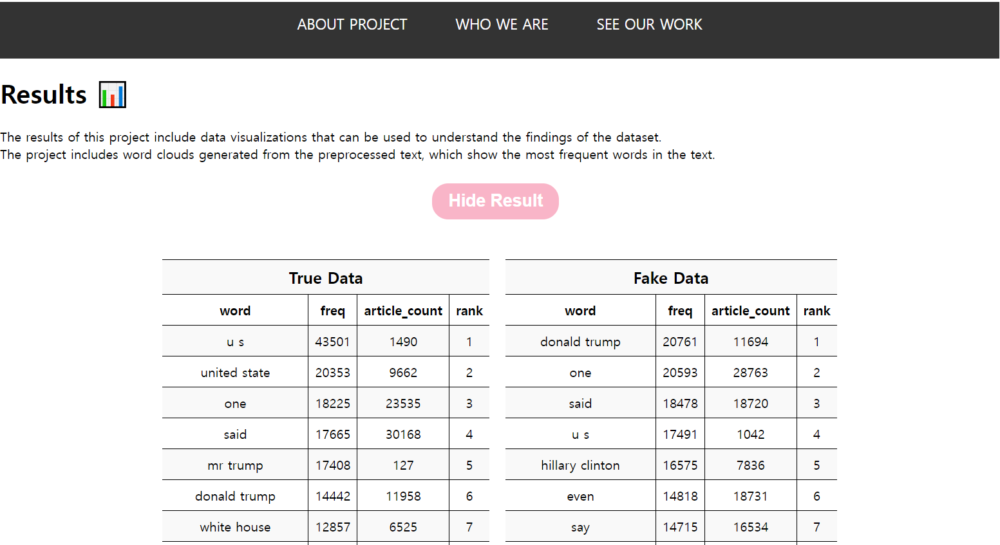

# dataWeb 💻🌐
I am proud to present dataWeb, a website that showcases our team's work in data analysis and visualization. As part of a hackathon project, we created this website to provide a user-friendly platform that is easily accessible to everyone.

## Our website includes:

- Detailed descriptions of the projects we have completed, including the data we analyzed and the visualizations we created
- Our key findings and insights from each project
- Engaging visuals that effectively communicate our data insights
- Information about the tools and techniques we used to collect and analyze data
- Contact information for our team members and Task descriptions for each team member
- Try page of Fake News Detector Program

As the creator of this website, I am excited to share our work with the world. Thank you for taking the time to visit dataWeb!
